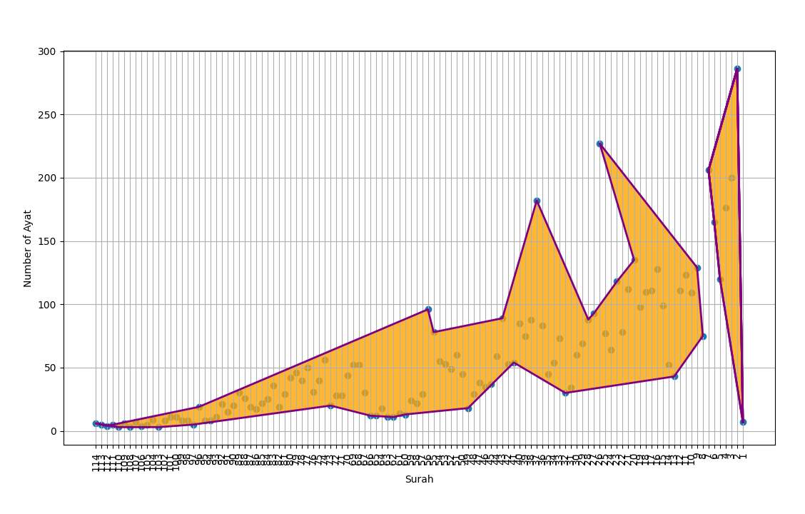

# Quran Visualization Pattern

A Python-based visualization project that reveals fascinating numerical patterns within the structure of the Quran. This project creates a visual representation of the number of verses (ayat) in each chapter (surah), which when plotted and connected in a specific sequence, forms the Arabic word "Allah" (الله).

## Inspiration

This project was inspired by:
- The original visualization concept demonstrated in [this video](https://www.youtube.com/watch?v=8-YBqmxJMx8)
- A Python implementation by Liza Yusoff detailed in [this blog post](https://signocessing.wordpress.com/2020/01/15/python-plot-of-number-of-ayat-in-surah-from-the-quran/)

## Features

- Visualizes all 114 surahs and their corresponding number of verses
- Highlights the "Lam-Lam-Ha" pattern (purple outline with orange fill)
- Displays the "Alif" pattern (purple outline with orange fill)
- Interactive matplotlib plot with grid lines for easy reference

## Requirements

- Python 3.6+
- pandas
- numpy
- matplotlib

## Installation

1. Clone the repository: 
bash
git clone https://github.com/ohmursyd/quran-visualization.git
cd quran-visualization

2. Install required packages:
bash
pip install -r requirements.txt

## Usage

1. Make sure both `quran_data.py` and `plot_quran_visualization.py` are in the same directory
2. Run the visualization script:
bash
python plot_quran_visualization.py

The script will generate a plot showing:
- A scatter plot of all surahs (x-axis) and their number of verses (y-axis)
- The "Lam-Lam-Ha" pattern filled in orange with blue outline
- The "Alif" pattern with purple outline and orange fill
- Grid lines for reference

## Project Structure
quran-visualization/
├── plot_quran_visualization.py # Main visualization script
├── quran_data.py # Quran structural data
├── requirements.txt # Python dependencies
├── README.md # This file
└── previewquran.png # Visualization preview image

## Data Structure

The project uses a simple data structure in `quran_data.py` that contains:
- The surah numbers (1-114)
- The number of verses in each surah
- Specific sequence data for forming the "Lam-Lam-Ha" and "Alif" patterns that create the Arabic word "Allah"

## Contributing

Contributions are welcome! Please feel free to submit a Pull Request.

1. Fork the repository
2. Create your feature branch (`git checkout -b feature/AmazingFeature`)
3. Commit your changes (`git commit -m 'Add some AmazingFeature'`)
4. Push to the branch (`git push origin feature/AmazingFeature`)
5. Open a Pull Request

## Acknowledgments

- Thanks to all contributors who help maintain and improve this visualization
- Special thanks to the Islamic scholars and researchers who study the numerical patterns in the Quran

## Contact

Ariff Mursyidi - [@Ariff_Mursyidi](https://t.me/Ariff_Mursyidi)

Project Link: [https://github.com/ohmursyd/quran-visualization](https://github.com/ohmursyd/quran-visualization)

## Note

This visualization is intended for educational and research purposes. The patterns shown are based on the numerical structure of the Quran's chapters and verses. The remarkable pattern that emerges when plotting the verse counts in this specific sequence was discovered by researchers studying the mathematical structure of the Quran.